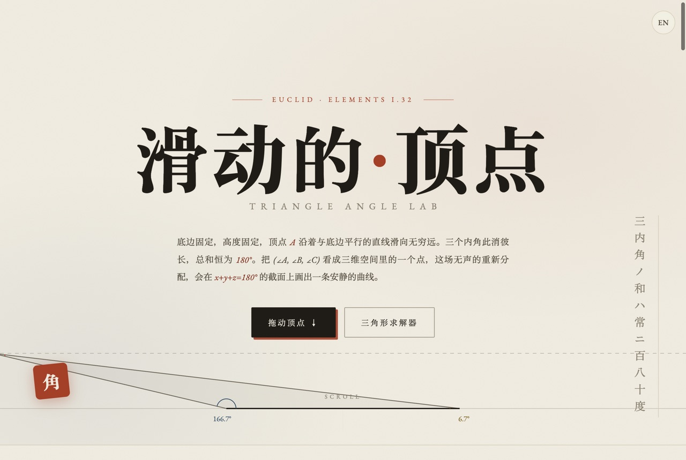
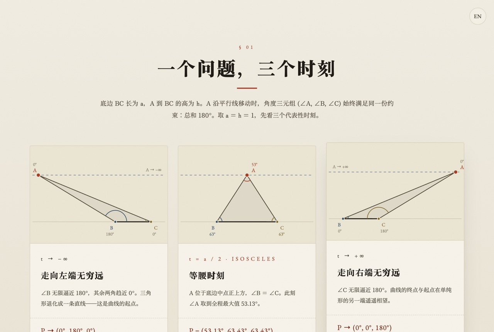
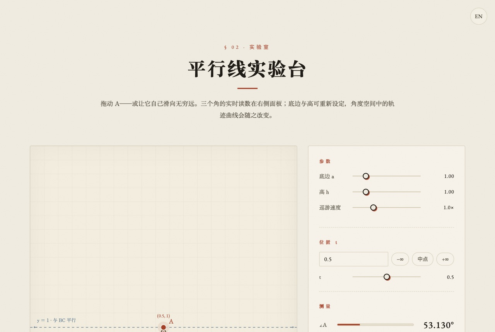
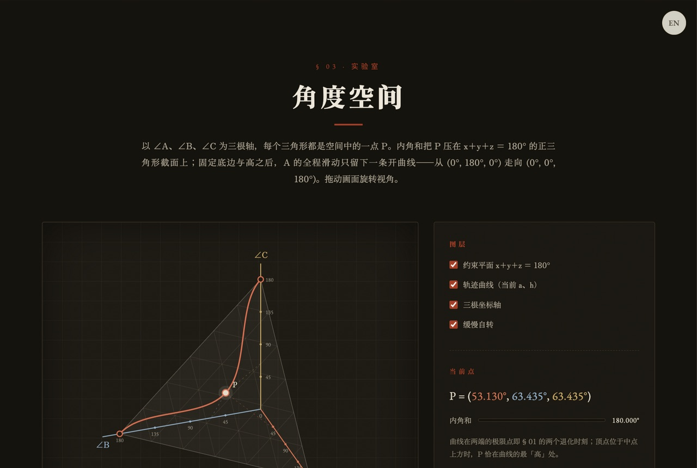
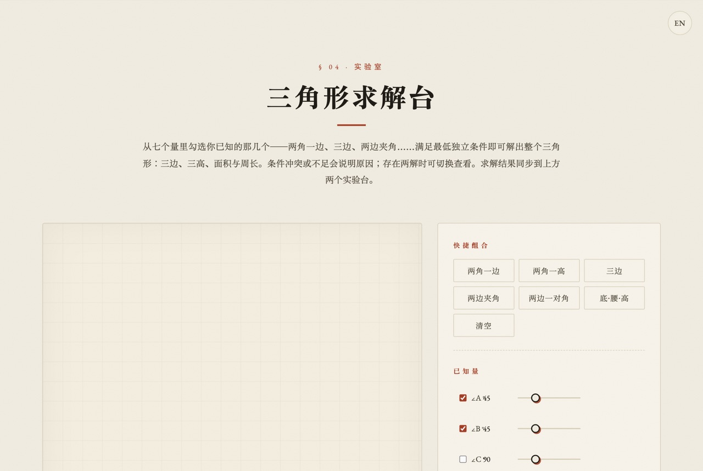

# 滑动的顶点 · 三角形角度实验室

> **The Moving Vertex · Triangle Angle Lab**
>
> 底边固定，高度固定，顶点 A 沿着与底边平行的直线滑向无穷远。
> 三个内角此消彼长，总和恒为 180°（欧几里得《几何原本》命题 I.32）。
> 把 (∠A, ∠B, ∠C) 看成三维空间里的一个点 P，这场无声的重新分配
> 会在 x + y + z = 180° 的截面上画出一条安静的曲线。

[](https://triangle-angle-lab.vercel.app)
[](LICENSE)

---

## 截图预览

| 封面 | 三个时刻 |
|:---:|:---:|
|  |  |

| 平行线实验台 | 角度空间 | 求解台 / 推导 |
|:---:|:---:|:---:|
|  |  |  |

---

## 功能亮点

### 📐 一个问题，三个时刻（§ 01）
- t → −∞、t = a/2（等腰时刻，∠A 最大）、t → +∞ 三个代表性位置
- 每个时刻的角度三元组与退化极限

### 🧪 平行线实验台（§ 02）
- 拖动顶点 A 沿平行线移动；**拖到画布边缘可继续滑向无穷远**（自动平移 + 缩放）
- ±∞ 极限、坐标输入（支持 `1e20`、`+∞`）、角度空间等距导航条
- 底边 a 与高 h 可调；「巡游」动画自动扫过全程
- 三个内角实时读数 + 锐角 / 钝角 / 直角 / 等腰状态判定

### 🌌 角度空间（§ 03，暗色实验室）
- 以 ∠A、∠B、∠C 为三根轴，纯 Canvas 手绘 3D 投影（无 Three.js 依赖）
- 内角和约束平面（2-单纯形截面）+ 当前 a、h 下的开曲线轨迹
- 当前点 P 与三轴虚线投影，随上方实验台实时联动；拖拽旋转 / 滚轮缩放 / 缓慢自转

### 🔺 三角形求解台（§ 04）
- 七个量（∠A∠B∠C、a、b、c、h）任意勾选组合，实时求解
- 覆盖 AAS / AAH / SSS / SAS / SSA / 底·腰·高等快捷组合
- **SSA 两解可切换查看**；条件冲突 / 不足 / 仅定形（AAA）均给出原因
- 输出三边、三高、面积、周长，并同步到上方两个实验台
- 求解核心通过 3000+ 组随机参数回归验证，含大数与镜像情形

### 📜 纸上的推导（§ 05）
- 坐标化 → atan2 求角 → 2-单纯形 → 正弦定理 → 余弦定理与 Heron 公式
- 每段推导配 Canvas 手绘小图

### 🌐 中英双语国际化
- 自动识别浏览器语言，一键切换中 / 英
- localStorage 记忆偏好，切换时保留当前实验状态

---

## 技术栈

| 层 | 技术 |
|---|---|
| 结构 | 原生 HTML5 |
| 样式 | CSS3（Custom Properties / clamp / Grid） |
| 逻辑 | Vanilla JavaScript（ES2020+） |
| 渲染 | Canvas 2D API（含手绘 3D 投影） |
| 国际化 | 自研 i18n 引擎（词典 + data-i18n + CustomEvent） |
| 部署 | Vercel（GitHub 推送自动部署） |
| 字体 | Zen Old Mincho / Noto Serif SC / EB Garamond |

**零框架、零构建工具、零 npm 依赖。**

---

## 本地运行

```bash
git clone https://github.com/meifu2027/triangle-angle-lab.git
cd triangle-angle-lab

# 任意静态服务器即可
python3 -m http.server 8080
```

打开 `http://localhost:8080` 即可体验。

---

## 项目结构

```
.
├── index.html              # 主页面（英雄区 + 5 大章节）
├── css/
│   └── style.css           # 制图纸墨色设计系统 + 三角色彩系统
├── js/
│   ├── i18n.js             # 国际化引擎（中英词典 + 运行时）
│   ├── solver.js           # 三角形求解核心（纯数学，语言无关）
│   ├── lab.js              # 平行线实验台 + 角度空间（共享状态）
│   ├── solver-ui.js        # 求解台面板（与实验台联动）
│   ├── formulas.js         # §01 时刻卡片 + §05 推导小图
│   └── main.js             # 英雄区动画 / 滚动渐显
├── assets/
│   └── screenshots/        # README 截图
└── README.md
```

---

## 数学背景

设 B(0, 0)、C(a, 0)、A(t, h)：

- **三个角**：∠B = atan2(h, t)，∠C = atan2(h, a − t)，∠A = 180° − ∠B − ∠C
- **角度空间**：内角和把 P = (∠A, ∠B, ∠C) 压在第一卦限的正三角形截面
  x + y + z = 180° 上；固定 a、h 后，t ∈ (−∞, +∞) 的轨迹是一条开曲线，
  从 (0°, 180°, 0°) 走向 (0°, 0°, 180°)，t = a/2 时 ∠A 取得最大值
- **求解**：AAS / AAH 由正弦定理直接可解；SSA 可能两解（射线与圆的两个交点）；
  SSS 用余弦定理 + Heron 公式；AAA 只定型不定量

---

## 设计风格

延续 [kakeya-set-visualization](https://github.com/meifu2027/kakeya-set-visualization)
的「和纸墨色」家族美学，本项目定制为**制图纸**性格：

- 底色：米色制图纸 `#f4efe3`，网格纸舞台
- 三角色彩系统：∠A 朱 `#b5371c` / ∠B 藍 `#33566e` / ∠C 金 `#8a6d1f`，贯穿全部可视化
- 角度空间采用「夜绘」暗色区段，朱红轨迹曲线为全页签名画面
- 数字统一使用 EB Garamond 数学排版

---

## 贡献

欢迎 Issue / PR。如有数学错误或可视化改进建议，请直接提出。

---

## 许可证

[MIT](LICENSE) © 2026 [meifu2027](https://github.com/meifu2027)
